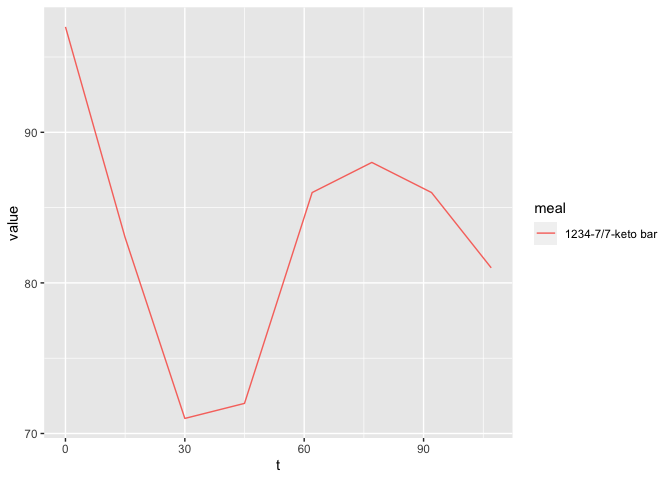

cgmr: continous glucose monitoring for R
================
2021-09-27

Continuous Glucose Monitoring Package for R

Process raw CGM data from Freestyle Libreview, Levels, Nutrisense and
others.

# Prerequisites

Download a CSV file from Libreview.com

``` r
library(tidyverse)
library(lubridate)
library(cgmr)

cgm_sample <- glucose_df_from_libreview_csv(system.file("extdata", package = "cgmr", "Firstname1Lastname1_glucose.csv"))

glucose_records <- cgm_sample 
notes_records <- notes_df_from_glucose_table(glucose_records)

head(glucose_records)
```

    ## # A tibble: 6 × 7
    ##   time                 scan  hist strip value food  user_id
    ##   <dttm>              <dbl> <dbl> <dbl> <dbl> <chr>   <dbl>
    ## 1 2021-05-30 16:59:00    NA    69    NA    69 <NA>     1234
    ## 2 2021-05-30 17:14:00    NA    66    NA    66 <NA>     1234
    ## 3 2021-05-30 17:30:00    NA    62    NA    62 <NA>     1234
    ## 4 2021-05-30 17:45:00    NA    60    NA    60 <NA>     1234
    ## 5 2021-05-30 18:00:00    NA    62    NA    62 <NA>     1234
    ## 6 2021-05-30 18:15:00    NA    64    NA    64 <NA>     1234

``` r
head(notes_records)
```

    ## # A tibble: 3 × 6
    ##   Start               End    Activity Comment                         Z user_id
    ##   <dttm>              <dttm> <fct>    <chr>                       <dbl>   <dbl>
    ## 1 2021-07-07 12:45:00 NA     Food     zoodles ground beef cupcake    NA    1234
    ## 2 2021-07-07 18:50:00 NA     Food     pork belly cauliflower         NA    1234
    ## 3 2021-07-07 19:30:00 NA     Food     keto bar                       NA    1234

The most important function, `food_times_df_fast()` looks through all
glucose and notes records to return a dataframe of times during a time
interval after eating a specific food, in this case “Keto Bar”, which
the CGM wearer entered in the Notes field of the app.

``` r
ft <- food_times_df_fast(glucose_records, notes_records, foodname = "keto bar")

ft
```

    ## # A tibble: 8 × 8
    ##       t value username date_ch timestamp           meal         foodname user_id
    ##   <dbl> <dbl> <chr>    <chr>   <dttm>              <chr>        <chr>    <fct>  
    ## 1     0    97 1234     7/7     2021-07-07 19:30:00 1234-7/7-ke… keto bar 1234   
    ## 2    15    83 1234     7/7     2021-07-07 19:30:00 1234-7/7-ke… keto bar 1234   
    ## 3    30    71 1234     7/7     2021-07-07 19:30:00 1234-7/7-ke… keto bar 1234   
    ## 4    45    72 1234     7/7     2021-07-07 19:30:00 1234-7/7-ke… keto bar 1234   
    ## 5    62    86 1234     7/7     2021-07-07 19:30:00 1234-7/7-ke… keto bar 1234   
    ## 6    77    88 1234     7/7     2021-07-07 19:30:00 1234-7/7-ke… keto bar 1234   
    ## 7    92    86 1234     7/7     2021-07-07 19:30:00 1234-7/7-ke… keto bar 1234   
    ## 8   107    81 1234     7/7     2021-07-07 19:30:00 1234-7/7-ke… keto bar 1234

And of course you can easily plot the results

``` r
ft %>% ggplot(aes(x=t, y = value, color = meal)) + geom_line()
```

<!-- -->
